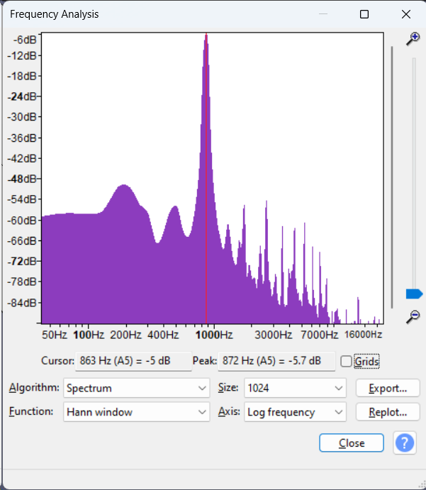
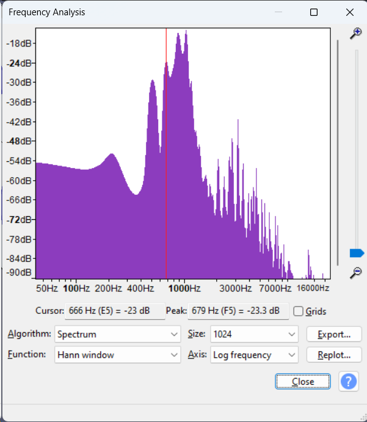
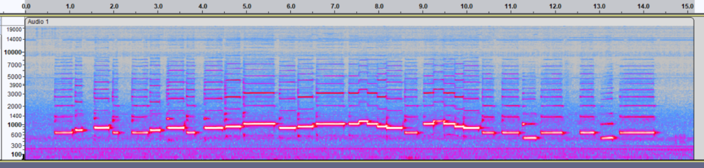
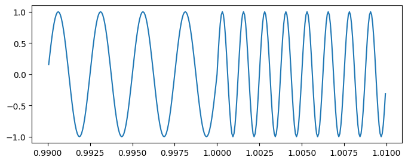
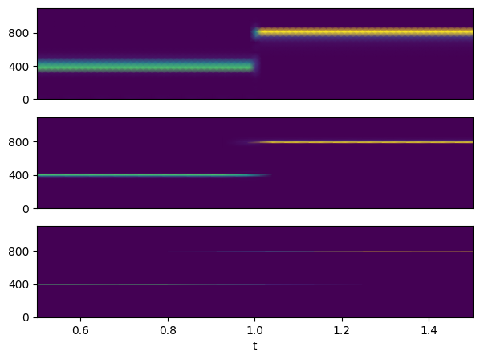

Title: The uncertainty principle and spectrograms
Date: 2024-01-09
Category: Physics
Tags: physics, quantum-mechanics, music, teaching
Slug: uncertainty-principle-and-spectrograms

In the [previous post](uncertainty-principle-obvious-to-musicians) I discussed how, when measuring the frequency (tempo) of a signal that itself changes in time, there is necessarily a tradeoff between the precision in the measured frequency and precision in the time at which the measurement is taken: A more precise measurement of frequency requires that the sample be taken over a longer period of time. This is particularly well demonstrated in signal processing and spectrograms.

## Fourier decomposition

Recall first of all that any signal can be decomposed into its frequency components: this is the Fourier transform. Pure tones, which consist of a single frequency component, are given by sine waves. Most instruments do not produce pure tones when they play a note; instead, they play a mixture of tones, which together give the unique timbre of the instrument.

For example, this is an A5 played on an alto recorder:
<audio src="static/APlayedOnTrebleRecorder.wav" controls></audio>

Its spectrum, given by taking a Fourier transform of the signal, looks like this \[[ref]By convention, both axes are drawn on logarithmic scales. The relative amplitudes are measured in [decibels](https://en.wikipedia.org/wiki/Decibel), a logarithmic unit; 0 dB corresponds to the maximum amplitude that can be represented by the file format.[/ref]\]:

Spectrum of the recorder. Note the log scales.

The spectrum consists of a peak around f = 880 Hz (slightly lower in this example), which is the fundamental frequency for A5, along with further, smaller peaks, at integer multiples of f = 880 Hz ('overtones' or 'harmonics'). The overall sound is periodic with frequency 880 Hz, giving a tonal sound.

## Varying pitch

Most music consists of more than one note. \[[ref][John Cage might disagree.](https://www.youtube.com/watch?v=AWVUp12XPpU)[/ref]\]

<audio src="static/FrereJacque.wav" controls></audio>

If you wanted to analyse the notes in that track, taking the Fourier transform of the entire track is not particularly interesting.

Spectrum of the entire recording.

This spectrogram contains contributions from _all_ the notes in the track. This is like measuring pulse by sampling the heartbeat over a whole day: it gives no information about the pulse at any given time. This playthrough was in F major; some notes (F and C) were played more often than other notes, so there are still peaks at those notes, but all other detail has been lost.

It is much more useful to work with the [short-time Fourier transform](https://en.wikipedia.org/wiki/Short-time_Fourier_transform) (STFT). At each timestep, take a Fourier transform of the part of the signal around that time. \[[ref]To avoid edge effects, a window function is usually applied to smooth the signal. Audacity uses the Hann window by default, SciPy uses Tukey. The [SciPy docs](https://docs.scipy.org/doc/scipy/reference/generated/scipy.signal.get_window.html) have many other examples.[/ref]\] The STFT is a function of both time and frequency, so it is usually visualised as a spectrogram:

Spectrogram of the above recording (window size 2048 with Hann smoothing). Time on the horizontal axis, frequency (logarithmic) on the vertical axis, colour intensity for amplitude.

As seen, each note consists of an intense fundamental frequency alongside a stack of harmonics.

As with the pulse measurement procedure in the last post, the length of the window over which the spectrogram is taken is a free parameter. The effect of this parameter is very well illustrated by the following example.

## Two tones

Consider a signal consisting of a 1 second tone at 400 Hz followed by a 1 second tone at 800 Hz. The signal is sampled at 16 kHz.

<audio src="static/TwoTones.wav" controls></audio>

The waveform is a sine wave for 0 < t < 1, and a higher-frequency sine wave for 1 < t < 2. For simplicity, the phases are aligned so that the wave is continuous at t = 1.

The spectrograms when the window size is 256, 1024 and 4096 (with Tukey smoothing). These correspond to intervals of 16 ms, 64 ms and 256 ms respectively.

Spectrograms of the two tones for window sizes 256, 1024, 4096

The tradeoff between precision in frequency and precision in time is now very visible.

Away from the transition at t = 1, the larger the window for the STFT the more precise the estimate for frequency will be: thus the first spectrogram contains wide bands, since the narrowest window spans only about 6 periods, while the last spectrogram has thinnest bands since the widest window spans over 100 periods.

However, near t = 1, the window for the STFT contains samples from both t < 1 (at 400 Hz) and from t > 1 (at 800 Hz), so the computed STFT contains components from both. The region that is affected by this is largest for the widest window. Thus, a STFT with a wider window does a poorer job of detecting the time at which a frequency transition occurs.
