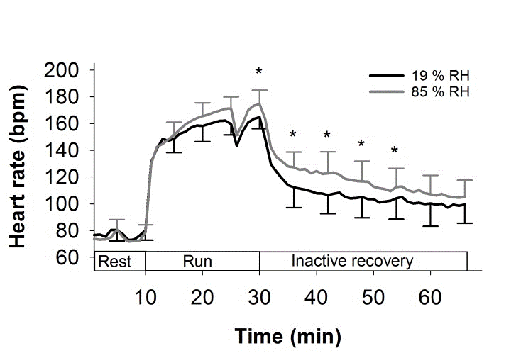

Title: The uncertainty principle is obvious to musicians
Date: 2024-01-09
Category: Physics
Tags: physics, quantum-mechanics, music, teaching
Slug: uncertainty-principle-obvious-to-musicians

Most people are introduced to the term 'uncertainty principle' in the context of quantum mechanics. It is usually described as the idea that a particle's position and momentum cannot be simultaneously measured to arbitrary precision, but that improved precision in one must be traded off against increased uncertainty in the other. As such, the idea can be confusing because it is such a stark departure from our classical notion of a particle having definite, if not directly measurable, properties. Philosophical objections aside, the proof of the uncertainty relation is mathematically fairly straightforward, but it relies on the operator definitions of position and momentum, which are not themselves obvious.

In fact, the uncertainty principle arises in all wave-like (periodic) signals, and is intrinsic to the relationship between space and wavenumber (inverse wavelength), or for time-domain signals, between time and frequency. It arises in quantum mechanics from the fact that particle states are modelled by wavefunctions – as demonstrated in the double-slit experiment – and that momentum is linearly proportional to wavenumber. But it arises in far more everyday scenarios too.

Consider the act of determining the beats per minute (bpm) of a heartbeat, or of the pulse of a piece of music. One counts the number of pulses $latex n$ within in a period of time $latex T$ seconds, and estimates the bpm as \[ \widehat{BPM} = \frac{60 \times n}{T}. \]

There are several sources of uncertainty in this estimate:

1.  There will be some imprecision in when the measurement is stopped, _i.e._ an uncertainty in $latex T$. For very fast pulses, there may be several beats that are either counted or missed, depending on whether one stops measuring late or early.
2.  Similarly, for slow pulses it also matters whether one begins timing just before a beat or just after.
3.  There are intrinsic fluctuations in the amount of time between consecutive pulses.

The first two uncertainties can be reduced by taking a larger value of $latex T$. A good value of $latex T$ should be much larger than the pulse itself, and much larger than the uncertainty in $latex T$. Supposing there is an uncertainty of 100ms in when we stop the measurement, taking the measurement over $T = 15$ seconds will give a reasonable estimate for pulses between 4 bpm and 600 bpm.[1](#b9e5d6d8-6afe-4af7-b162-d2ea3a1c4dd2) This is (hopefully) adequate for most cardiological and musical purposes, but we might ask whether we can do better.

We can't do much about the uncertainty in measuring $latex T$: it is limited by the quality of our stopwatch and our reaction time. But we can more freely choose how long we measure for (provided we are patient); can we get a more reliable estimate for lower frequencies by taking the measurement over a longer amount of time?

If the pulse keeps at a steady tempo, yes: eventually we will count over a long enough interval that both the edge effects (2) become insignificant and the fluctuations (3) average out, giving a good estimate for the bpm.

This is a bad assumption, though. Most healthy heart rates are higher in the afternoon and lower during sleep, and may quickly spike to very high levels during intense exercise:

Credit: [circadian.org](https://www.circadian.org/vital.html)

To take an extreme case, if we count the number of pulses over 24 hours, we will get an estimate of the average heart rate over an entire day[2](#45a6cb4d-5a13-4172-88eb-8bf74a9ee2c1), but it doesn't give any information at all about the heart rate at any given time. To make a graph of the circadian pattern like the one above, we need to take measurements every 30 minutes (say), and each measurement should not take more than a couple of minutes.[3](#242810b1-658e-46b5-a464-34fa456d60a6)

So, _we have a tradeoff between the time resolution ('certainty'), and the precision of estimates_.

How long each interval should be, and how frequently they are taken, depends on the desired resolution. For example, during an exercise session, heart rate can vary much more quickly over a few minutes:

Credit: Høye _et al._ (2019) [10.14198/jhse.2020.151.13](http://dx.doi.org/10.14198/jhse.2020.151.13)

To improve the temporal resolution, not only must we now take much more frequent measurements, but also, each measurement interval must also be shorter.[4](#06076c2b-7bc0-4f2e-a940-6366371dc01d) This reduces the precision of each estimate of the bpm, but we see time-dependence that we wouldn't see if we just took measurements over several minutes, or indeed a single measurement over 60 minutes.

There was no quantum mystery in any of this: the tradeoff between temporal resolution and bpm precision comes simply from the fact that the bpm is changing over time. There is no such thing as _the_ heart rate at 8:32am – not something one can measure, anyway. What we can measure is the _average_ heart rate between 8:32am and 8:33am. This doesn't tell us anything about what is happening within that minute, but likewise won't be affected by anything happening at 10am.

Musicians will recognise the following obvious statement:

_When there is an accelerando or a rallentando, the tempo isn't fixed._

In the next post on this subject, I will give another example of the uncertainty principle that arises in signal processing that illustrates the same point.

---
